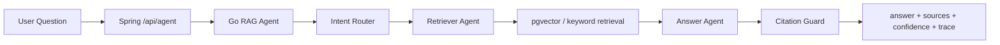

# KnowFlow Agent Design

## Overview

KnowFlow keeps the original RAG architecture and adds a lightweight Agent layer inside the Go RAG Service. Spring Boot remains the business backend and exposes `/api/agent/ask` plus `/api/agent/ask/stream`.



## Roles

- Intent Router: heuristic v1 router outputs `qa`, `summarize`, `study_plan`, `code_analysis`, `report`, or `unknown`.
- Retriever Agent: expands the retrieval query by intent and runs the existing pgvector/keyword retriever scoped by `kbId`.
- Answer Agent: builds an intent-aware prompt and uses the existing LLM Provider abstraction.
- Citation Guard: if sources are empty or confidence is too low, the answer is downgraded to “知识库中未找到足够依据回答该问题。”

## API Shape

`POST /api/agent/ask`

```json
{
  "kbId": 1,
  "sessionId": 10,
  "question": "帮我总结这份文档"
}
```

Response:

```json
{
  "intent": "summarize",
  "answer": "...",
  "sources": [],
  "confidence": 0.72,
  "trace": [
    {"step": "router", "detail": "intent=summarize"},
    {"step": "retriever", "detail": "query=..."},
    {"step": "citation_guard", "detail": "sources=5 confidence=0.72"}
  ]
}
```

Streaming uses standard SSE events: `meta`, `token`, `sources`, `error`, `done`.
