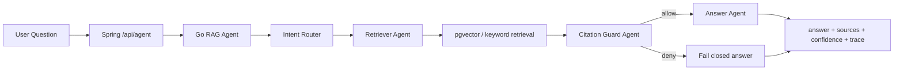

# KnowFlow Agent Design

## Overview

KnowFlow keeps the original RAG architecture and adds a lightweight Agent layer inside the Go RAG Service. Spring Boot remains the business backend and exposes `/api/agent/ask` plus `/api/agent/ask/stream`.



## Roles

- Intent Router: heuristic v1 router outputs `qa`, `summarize`, `study_plan`, `code_analysis`, or `unknown`.
- Retriever Agent: expands the retrieval query by intent and runs the existing pgvector/keyword retriever scoped by `kbId`.
- Answer Agent: builds an intent-aware prompt and uses the existing LLM Provider abstraction.
- Citation Guard: checks sources before answer generation. Empty sources fail closed; weak evidence lowers confidence and adds a visible warning.

## 防幻觉设计

- `sources` 为空：固定回答“知识库中未找到足够依据，无法回答该问题。”，`confidence = 0`，不调用 LLM。
- `sources` 数量小于 2：允许回答，但 `confidence <= 0.6`。
- 最高 `score < 0.5`：允许回答，但 `confidence <= 0.5`，回答前增加“当前知识库依据较弱，仅供参考。”
- sources 充足：按最高分、平均分和引用数量估算 confidence，并写入 trace。

## API Shape

`POST /api/agent/ask`

```json
{
  "kbId": 1,
  "sessionId": 10,
  "question": "帮我总结这份文档"
}
```

Response:

```json
{
  "intent": "summarize",
  "answer": "...",
  "sources": [],
  "confidence": 0.72,
  "trace": [
    {"step": "router", "detail": "识别为文档总结"},
    {"step": "retriever", "detail": "检索到 5 个相关片段"},
    {"step": "citation_guard", "detail": "sources=5 maxScore=0.82 avgScore=0.74"},
    {"step": "answer", "detail": "基于资料生成回答，intent=summarize llmMs=980"}
  ],
  "latencyMs": 1240
}
```

Streaming uses standard SSE events: `meta`, `token`, `sources`, `error`, `done`.
